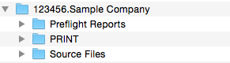
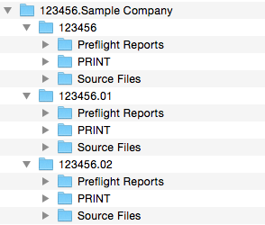

# Create Folders (AppleScript)

This simple script was created to help with a repetitive task one of our teams faced throughout each day.
On average 200 times a day, they needed to create a particular folder structure on their Macs to store the
files that accompanied each order. Although the structure is probably unique to this team, the script is
easily modified to suit other uses.

Our folder structure contained a parent folder with the order number and customer name. Inside this, we
had three subfolders: Preflight Reports, Source Files, and PRINT. Imagine creating that 200 times a day!

To further complicate matters, some orders contained sub-orders. The parent folder was named the same as
above, but this time, it contained a separate subfolder for each suborder. These had the same name as the
order number, except that all but the first one had a two-digit suffix. The three subfolders in the previous
example were to be added to each subfolder. Now *that* could get very time-consuming!

## Activate the Script menu

If you haven't done so already, make sure the *Script* menu is visible in the menu bar. Although not
strictly necessary, it's a great way to access built-in and custom scripts from anywhere.

Start by opening up *AppleScript Editor* (or *AppleScript Utility* in older versions), and go to the
preferences. There should be a check box asking to show the script menu in the menu bar. Select it,
and you're done!

## Installing the Script

Installation is as simple as copying the file to the correct folder. Under the script menu, go to
*Open Scripts Folder > Open User Scripts Folder*. When the folder opens, simply drop the file anywhere
inside it to make it available under the script menu.

You can also open the computer scripts folder instead of the user scripts folder. The main difference
is that scripts added here will be available to all users.

## Running the script

Select the script from the script menu, and a few dialog boxes appear looking for information. The
specific information can be changed in the script itself (see below). Once it gets the order number,
customer name and number of parts, it generates the appropriate folder(s) much quicker than a
human operator would.

## Customising the script

It's unlikely you'll need exactly the same folder structure as our team. That's fine, just customise
it to suit your workflow!

For example, you might like to have a new folder for each project you're working on, with simply the
project name. Inside, perhaps you'd like subfolders called 'Reference Materials', 'Drafts', and
'Finished files'. Here's what to do:

1. Change the wording 'Enter Job Number:' on line 15 to something like 'Enter Project Name:'
2. For clarity, you would probably change the variable name *job_number* to something more meaningful, like *project_name* (rememeber to do a complete Find & Replace throughout the whole script).
3. Get rid of the second and third dialogs, by deleting lines 20 to 30 inclusive.
4. In the subroutine that begins *on addFolders(pf)*, change all three folder names to match the subfolders you need. TIP: you can add or delete as many other folders as you like!
5. The line beginning *set parentFolder to make new folder...* sets the name of the parent folder. Change the section *{name:job_number & "." & customer_name}* to *{name:project_name}*
6. The whole section between *if job_parts > 1 then* and *beep 2* can be completely replaced by the line *my addFolders(parentFolder)*. Feel free to add the *beep 2* after it if you really want!
 
That's it! Once you go through the steps a couple of times, you'll see it's easy to make the script
work to your specifications. Try and work on a copy, so you can go back and compare. Good luck!
